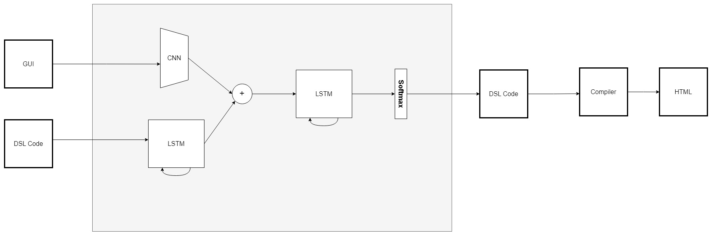

# Pix2HTML

## Motivation

Pix2HTML is my implementation of the [Pix2Code](https://arxiv.org/abs/1705.07962) paper. The goal of this project is to convert GUIs created by designers into valid HTML code using an end-to-end deep learning approach. This repository contains all the necessary code to train Pix2HTML using CNNs and LSTMs. You can find the training [notebook on Kaggle](https://www.kaggle.com/code/karimgamaleldin/pix2html) and [model parameters](https://drive.google.com/drive/folders/1Vk6MacZx-Y8MNfdajfcN1kXeTfe0UaUZ).

## Tech Stack

## Architecture

## Results

For text generation in the evaluation phase, I used:

1. Greedy Search
2. Beam Search (Beam = 3)
3. Beam Search (Beam = 5)

and the BLEU scores were as follows:

| Model       | Greedy search | Beam Search, Beam = 3 | Beam Search, Beam = 5 |
| ----------- | ------------- | --------------------- | --------------------- |
| VGG + LSTMs | ~0.78         | ~0.80                 | ~0.80                 |

More experiments are coming.

## Credits

- [Tony Beltramelli](https://github.com/tonybeltramelli)
- [Pix2Code Paper](https://arxiv.org/abs/1705.07962)
